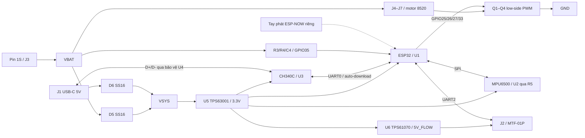

> Cập nhật 15/09/2026: đã sửa đường VBAT/PWM1 xâm lấn antenna; kiểm tra độc lập cả hai lớp không còn track/via/pad/zone trong vùng antenna. ERC/DRC và kiểm tra đồng nhất schematic/PCB sạch. Chi tiết mới nhất: [log sửa antenna](validation/antenna_fix/BAO_CAO.md). Các nhận xét antenna chưa đạt ở nội dung cũ bên dưới là kết quả trước đợt sửa này.

# Báo cáo đối chiếu datasheet, sơ đồ, PCB, 3D và firmware FC_ESP32

Ngày kiểm tra: 14/09/2026. Công cụ: KiCad 10.0.6, Python/pcbnew, kiểm tra mã C trên host với AddressSanitizer và UndefinedBehaviorSanitizer.

## 1. Kết luận cần đọc trước

**Chưa thể kết luận mạch chắc chắn chạy, và chưa nên đặt sản xuất để bay ngay.** Sơ đồ chân tín hiệu/nguồn đã kiểm tra khớp; ERC/DRC/parity vẫn sạch. Nhưng rà soát theo datasheet đã phát hiện vấn đề anten, layout nguồn và cấu hình/tính năng firmware mà các kiểm tra đó không chứng minh được.

Đặc biệt, **VBAT và PWM1 đang chạy ở B.Cu trong vùng anten ESP32**. Rule area hiện tại chỉ cấm track F.Cu; rule trên hai lớp cấm đổ đồng nhưng cho phép track. Vì vậy kết quả DRC bằng 0 là đúng với bộ rule hiện hành, nhưng không có nghĩa layout đáp ứng yêu cầu anten. Kết luận hoàn tất ở báo cáo trước chỉ có giá trị về kết nối theo rule, không phải xác nhận đủ điều kiện hoạt động.

Trong lượt này chỉ bổ sung công cụ kiểm tra, log và báo cáo; chưa sửa routing hay đổi cấu hình firmware để tránh che mất trạng thái đang được đánh giá.

## 2. Đã kiểm tra những gì, bằng chứng ở đâu

| Hạng mục | Kết quả | Bằng chứng |
|---|---|---|
| Schematic ERC | 0 vi phạm | `validation/datasheet_audit/erc_drc.log` |
| PCB DRC, refill zones | 0 vi phạm theo rule hiện tại | Cùng log; `FC_ESP32/drc_current.json` |
| Kết nối thiếu, schematic parity | Đều 0 | `FC_ESP32/validation_summary.json` |
| Đối chiếu pin độc lập | 135 pad instances được so với mapping datasheet/yêu cầu, không sai net | `validation/datasheet_audit/audit.json` |
| Toàn bộ pad | 279 pad instances ghi lại số chân, tên chân schematic, net schematic/PCB, tọa độ, góc, mặt | `validation/datasheet_audit/pin_audit.csv` |
| Pin không dùng/reserved/flash | Không thấy bị nối vào net chức năng ngoài ý muốn trong các nhóm đã kiểm tra | `tools/review_design.py` |
| GPIO firmware | Các macro giao tiếp/motor khớp yêu cầu và PCB | `validation/datasheet_audit/pin_check.log` |
| Motor pitch, pad dịch, J2, độ dày, netclass | Audit đạt | `validation/datasheet_audit/invariants.json` |
| Anten kiểm tra độc lập | **Không đạt**: 23 đoạn track giao vùng anten; tổng diện tích hợp giao khoảng 2.823 mm²; VBAT/PWM1 ở B.Cu | `validation/datasheet_audit/antenna_audit.json` |
| Firmware host tests | Cả 3 nhóm đạt | `validation/datasheet_audit/firmware_tests.log` |
| ESP-IDF build toàn bộ hiện tại | Chưa chạy trong lượt này; không tìm thấy SDK/toolchain ở các vị trí đã dùng trước | Không coi host tests là build ESP32 |
| 3D mặt trên/mặt dưới | Đã render mới và xem trực tiếp | `validation/datasheet_audit/top_3d.png`, `bottom_3d.png` |
| Đo trên PCB thật, dòng/dao động/nhiệt, bay | Chưa thực hiện | Chưa có phần cứng/kết quả đo |

SHA-256 của schematic, PCB, project, firmware và datasheet local được lưu trong `validation/datasheet_audit/audit.json`. Log kiểm tra không được hiểu là thử nghiệm vật lý.

## 3. Các điểm cần xử lý theo mức ưu tiên

| ID | Mức | Phát hiện và ảnh hưởng | Việc cần làm |
|---|---|---|---|
| RF-01 | Cao | VBAT/PWM1 chạy dưới anten trong hình chữ nhật x=91…109, y=77.75…84.05 mm. Có thể làm giảm tầm liên lạc, tăng nhiễu, mất gói ESP-NOW | Sửa rule cấm track/via/pour trên cả hai lớp tại vùng anten, đi lại hai net, chạy DRC và đo link khi motor hoạt động |
| PWR-01 | Cao | BOOST_FB dài tổng 28.272 mm, U6–C17 cách tâm 7.653 mm; feedback trở lớn 1.8 MΩ/200 kΩ dễ nhạy nhiễu. Đường switch boost dài 11.795 mm | Bố trí lại cụm U6/L2/C17/R12/R13 thành cụm ngắn, có tụ input sát U6; đo ổn định khởi động, ripple và tải bước |
| CFG-01 | Cao trước nạp | BOM ghi ESP32-WROOM-32 (8MB), `sdkconfig.defaults` ép 8 MB. Datasheet ESP32-WROOM-32 tiêu chuẩn ghi 4 MB | Xác định đúng mã module/flash thực tế, kiểm tra flash ID, đồng bộ BOM và sdkconfig. Không tự coi tên thư viện “8MB” là bằng chứng |
| PWR-02 | Cao trước chạy motor | Chưa có mã/datasheet motor 8520 cụ thể, dòng chạy/kẹt và dữ liệu lực đẩy với Gemfan 1635 ba lá. Chưa chứng minh đường nguồn/MOSFET/diode đủ tải | Đo dòng bằng nguồn giới hạn dòng, xác nhận điện áp motor, tính lại đường đồng/diode/nhiệt theo tải thật |
| BOM-01 | Cao trước đặt hàng | L2 chỉ ghi “4.7uH >=1A shielded”, footprint 4×4, chưa có mã. L1 cũng cần xác nhận mã đầy đủ, footprint và đặc tính đúng bản mua | Chốt mã linh kiện, Isat/Irms/DCR/dung sai, điện dung hiệu dụng các MLCC ở điện áp làm việc |
| ASM-01 | Cần xác minh trước lắp | U2 có pad 25 GND trong footprint/library, trong bảng chân datasheet local chỉ định nghĩa 24 chân và không quy định pad 25 là chân tín hiệu GND | Lấy hướng dẫn assembly/land pattern đúng MPU-6500 để xác nhận nối/solder exposed pad; không suy từ hình 3D QFN chung |
| FW-01 | Chưa hoàn thiện chức năng bay | Mặc định motor bị khóa; peer/key ESP-NOW trống; chưa có firmware tay phát trong repo; chưa xử lý optical flow | Hoàn thành tay phát, cấu hình peer/key/channel, parser cảm biến, kiểm tra failsafe và cơ chế điều khiển trước khi mở motor |
| FW-02 | Cao trước bay | PID là hệ số tạm, chưa chứng minh trục IMU/dấu mixer/chiều motor; lỗi IMU hoặc pin dưới 3.5 V làm dừng motor ngay | Kiểm chứng dấu phản hồi, ngưỡng pin dưới tải, hành vi lỗi; cơ chế ngắt này không phải hạ cánh an toàn |
| PCB-01 | Cần đánh giá nguồn | BUCK_L1 có 7.601 mm, BUCK_L2 có 10.296 mm đồng; có đoạn thoát 0.25 mm dù netclass MotorPower 0.8 mm. VSYS có đoạn 0.2402/0.3 mm | Rà lại từng đoạn nguồn xung theo dòng đỉnh; không coi tên netclass là chiều rộng thật của mọi đoạn |
| USB-01 | Cần thử giao tiếp/ESD | USB_DP/DM có tổng 36.581/33.442 mm track, U4 cách J1 khoảng 8.112 mm theo tâm | Xem đường hồi và nhánh ESD, tối ưu vị trí U4 gần cổng, thử nhận USB cả hai chiều cắm; đây không phải kết quả đo impedance/ESD |

TI yêu cầu đường dòng xung ngắn/rộng, tụ và cuộn cảm sát IC, feedback sát control ground. Các chiều dài trên là tổng chiều dài segment mỗi net, không phải phép đo loop inductance hay trực tiếp delay; nhận định rủi ro dựa vào cả vị trí và routing. Nguồn: datasheet TPS6300x §10.1 và TPS6107x §13.1 trong `data_sheet/`.

Về anten, [Espressif hướng dẫn đặt anten ra ngoài board hoặc tạo khoảng trống thích hợp, rồi kiểm tra tầm liên lạc trên sản phẩm hoàn chỉnh](https://docs.espressif.com/projects/esp-hardware-design-guidelines/en/latest/esp32/pcb-layout-design.html#general-principles-of-pcb-layout-for-modules-positioning-a-module-on-a-base-board). Lỗi RF-01 được đo trực tiếp từ đồng PCB, không suy đoán từ màu ảnh 3D.

Về flash, [datasheet chính thức ESP32-WROOM-32](https://documentation.espressif.com/esp32-wroom-32_datasheet_en.html) mô tả module tiêu chuẩn 4 MB. Có thể phần cứng mua thực tế là biến thể khác; phải xác nhận thay vì kết luận chắc chắn đã mua sai.

## 4. Sơ đồ khối và nguyên lý mạch



### Nguồn pin, USB và 3.3 V

J3 pin 1 là VBAT, pin 2 là GND. VBAT cấp motor trực tiếp và đi qua D5 tới VSYS. USB VBUS đi qua D6 tới VSYS. D5/D6 tạo OR nguồn bằng Schottky: cathode pin 1 cùng ở VSYS, anode pin 2 ở từng nguồn vào. Khi có USB, 5 V thường chiếm ưu thế cấp logic. Đây **không phải mạch sạc pin**, không cân bằng pin, không bảo vệ đảo cực toàn bộ mạch. Motor nối trực tiếp VBAT nên D5 không bảo vệ nhánh motor khi đấu ngược pin. Không đưa nguồn 5 V vào J3.

U5 TPS63001 tạo 3.3 V từ VSYS. Pin 1 VOUT và pin 10 FB nối +3V3 đúng yêu cầu bản fixed 3.3 V; L1 nối pin 4–2. Pin 5 VIN, 6 EN, 7 PS/SYNC nối VSYS; PS/SYNC mức cao tắt power-save. Pin 8 VINA được lọc qua R11=100 Ω, C15=100 nF; pin 3 PGND, 9 GND, pad 11 về GND. C12/C13 là tụ đầu vào/ra. Dải input khuyến nghị của IC là 1.8–5.5 V, nhưng cần trừ sụt áp D5 và kiểm tra tải bước/độ bão hòa cuộn cảm. Datasheet TPS6300x, bảng Pin Functions và phần thiết kế ứng dụng.

### Nguồn 5 V cảm biến

U6 TPS61070 lấy đầu vào từ **+3V3**, không trực tiếp từ pin 1S. Pin 6 VBAT và pin 3 EN cùng +3V3; L2 từ +3V3 đến pin 1 SW; pin 2 GND; pin 5 VOUT là +5V_FLOW. R12 từ VOUT đến FB, R13 từ FB xuống GND:

`Vout ≈ 0.5 × (1 + 1.8M / 200k) = 5.0 V`.

Nếu chỉ xét 1% điện trở và VFB=0.495…0.505 V từ datasheet, khoảng tĩnh cực trị xấp xỉ 4.862…5.142 V; không bao gồm ripple, tải bước hay layout. C17 lọc đầu ra; C18 nằm ở nhánh cảm biến.

[MTF-01P dùng 5 V, dòng trung bình 100 mA, UART LVTTL 3.3 V/115200](https://micoair.cn/zh/docs/sensors/sensors/mtf-01p-sensors). Về mức logic có thể nối UART trực tiếp với ESP32. Tải cảm biến 0.5 W, giả thiết boost hiệu suất 85% thì lấy khoảng 178 mA từ rail 3.3 V, chưa cộng ESP32/CH340/IMU và dòng đỉnh. TPS61070 có giới hạn dòng switch, không được diễn giải là “cấp 600 mA ở 5 V”. Chưa có bằng chứng đủ tải đồng thời khi Wi-Fi phát và motor gây nhiễu.

Đường +5V_FLOW có 8.448 mm rộng 0.18 mm, còn lại 0.4 mm. Phép tính đồng 35 µm trong `validation/flow_power_review.json` cho tổng điện trở segment khoảng 0.114 Ω và sụt khoảng 11.4 mV ở 100 mA. Đây chỉ là đánh giá tổn hao DC của đường đồng, không giải quyết rủi ro layout boost nêu trên.

### MCU, reset, nạp chương trình

ESP32 pin 2 dùng 3.3 V; pin 1/15/38 và exposed ground pad 39 về GND. R1=10 kΩ kéo EN lên, C3=1 µF về GND tạo hằng số RC danh định 10 ms. R2=10 kΩ kéo GPIO0/BOOT lên. GPIO6–11 dùng cho flash được để không nối ra ứng dụng; GPIO34/35 là input-only, đang dùng đúng cho INT và ADC.

CH340C được cấp 3.3 V ở VCC pin 16 và V3 pin 4, đúng chế độ 3.3 V trong datasheet; C9=100 nF decouple. TXD pin 2 tới RX0 ESP32; RXD pin 3 nhận TX0 ESP32. CH340C có oscillator nội, không cần thạch anh ngoài. Pin 15 R232 nối GND; pin 7 NC và các modem input không dùng được để trống.

Q5/Q6 MMBT3904 có pin 1 base, 2 emitter, 3 collector. Q5 kéo EN khi DTR cao/RTS thấp; Q6 kéo BOOT khi RTS cao/DTR thấp. Hai mức DTR/RTS bằng nhau không bật transistor. Tên DTR#/RTS# active-low ở driver cần phân biệt với mức điện áp trên chân. Mạch này cho phép auto-download nhưng vẫn phải thử bằng esptool/driver thật. Không có nút BOOT/RESET vật lý trong BOM hiện tại.

USB-C có CC1/CC2 mỗi đường điện trở 5.1 kΩ về GND; D+ A6/B6 nối nhau, D− A7/B7 nối nhau. U4 USBLC6-2SC6 nối 1/6 với D−, 3/4 với D+, 2 GND và 5 VBUS, khớp [sơ đồ chân ST](https://www.st.com/resource/en/datasheet/usblc6-2.pdf). SBU không dùng. USB cung cấp giao tiếp USB–UART, không phải USB native của MCU, cũng không phải bộ sạc LiPo.

### MPU-6500

R5=10 Ω và các tụ C5/C6/C8 lọc rail +3V3_IMU. Pin 8 VDDIO và 13 VDD dùng rail này; pin 18 GND. Pin 10 REGOUT chỉ nối C7=100 nF về GND, không dùng làm nguồn ngoài. FSYNC pin 11 và reserved pin 20 nối GND; pin 19 reserved để trống. CS pin 22 được R6 kéo lên; SCLK pin 23, SDI pin 24, SDO pin 9, INT pin 12. Các chân NC và AUX không dùng không bị nối ra mạch chức năng. Đối chiếu datasheet MPU-6500 bảng 10, trang 17 và bảng linh kiện ứng dụng trang 19.

**Riêng exposed pad 25:** thư viện thêm pad này và nối GND; pin table local không đủ chứng cứ về yêu cầu hàn/nối pad đáy. Vấn đề này còn mở, không được tính là đã đạt hoàn toàn theo datasheet.

### Motor và phép đo pin

Mỗi motor nhận cực + từ VBAT, cực − đi vào drain pin 3 AO3400. Source pin 2 về GND; gate pin 1 nhận PWM qua 100 Ω, có 100 kΩ kéo xuống để tắt khi MCU chưa điều khiển. D1–D4 SS16 có cathode về VBAT, anode về drain: hướng diode hồi tiếp đúng. Tụ 100 nF trên mỗi nhánh giúp lọc nhiễu; hiệu quả còn phụ thuộc chiều dài dây và nguồn nhiễu tại chổi than.

AO3400 có RDS(on) tối đa 52 mΩ được đặc tả ở VGS=2.5 V, nên có cơ sở dùng gate logic 3.3 V. Không được lấy con số dòng 5.8 A ở VGS=10 V làm mức chịu tải đảm bảo trên cánh PCB nhỏ. SS16 được định mức dòng trung bình 1 A theo điều kiện datasheet; cần tính dòng hồi tiếp theo dạng sóng PWM, không chỉ dòng trung bình nguồn. Ví dụ tổn hao dẫn MOSFET xấp xỉ `I² × RDS(on) × duty`; ở 2 A, 52 mΩ và duty 1 đã là 0.208 W trước khi tính tăng điện trở theo nhiệt. Đây là ví dụ tính, không phải dòng motor đã đo.

R3/R4=100 kΩ chia VBAT đôi vào GPIO35/ADC1_CH7. Ở pin 4.35 V, ADC khoảng 2.175 V; dòng cầu chia khoảng 21.75 µA. C4=100 nF và trở Thevenin 50 kΩ tạo hằng số thời gian khoảng 5 ms. Firmware đổi ADC đã hiệu chuẩn ra volt rồi nhân 2. Sai số điện trở/ADC/Vref phải so lại bằng đồng hồ. Nhãn pin 3.8 V là điện áp danh định; điện áp sạc tối đa phải lấy từ chính nhãn/datasheet pack, không tự suy chắc chắn là 4.35 V.

## 5. Bảng chân ESP32 và nối thiết bị ngoài

Quy ước nhìn **mặt linh kiện**, anten ở trên, USB ở dưới. GPIO là số GPIO của ESP32; “pad U1” là số chân module, hai loại số không thay thế nhau.

| Chức năng | GPIO | Pad U1 | Đầu bên kia |
|---|---:|---:|---|
| Motor M1 — trên trái | 25 | 10 | R15 → Q1 gate → J4 |
| Motor M2 — trên phải | 26 | 11 | R17 → Q2 gate → J5 |
| Motor M3 — dưới phải | 27 | 12 | R19 → Q3 gate → J6 |
| Motor M4 — dưới trái | 33 | 9 | R21 → Q4 gate → J7 |
| MPU MISO | 19 | 31 | U2 pin 9 SDO |
| MPU MOSI | 23 | 37 | U2 pin 24 SDI |
| MPU SCLK | 18 | 30 | U2 pin 23 |
| MPU CS | 21 | 33 | U2 pin 22 |
| MPU INT | 34 | 6 | U2 pin 12 |
| Optical-flow TX | 17 | 28 | J2 pin 3 → RX cảm biến |
| Optical-flow RX | 16 | 27 | J2 pin 4 ← TX cảm biến |
| I2C SDA | 4 | 26 | J8 pin 3 |
| I2C SCL | 22 | 36 | J8 pin 4 |
| UART1 TX | 14 | 13 | J9 pin 3 → RX thiết bị |
| UART1 RX | 32 | 8 | J9 pin 4 ← TX thiết bị |
| UART0 RX/nạp | 3 | 34 | U3 pin 2 TXD |
| UART0 TX/log | 1 | 35 | U3 pin 3 RXD |
| Đo pin | 35 | 7 | R3/R4/C4 |
| Boot strap | 0 | 25 | R2 và Q6 |
| Enable/reset | — | 3 | R1/C3/Q5 |

| Connector | Pin 1 | Pin 2 | Pin 3 | Pin 4 |
|---|---|---|---|---|
| J2 MTF-01P | GND | +5V_FLOW | FC TX → sensor RX | FC RX ← sensor TX |
| J3 pin 1S | VBAT + | GND − | — | — |
| J4/J5/J6/J7 motor | VBAT + | Cực − được PWM, **không phải GND cố định** | — | — |
| J8 I2C | +3V3 | GND | SDA | SCL |
| J9 UART1 | +3V3 | GND | TX | RX |

J2 quay 90° ra cạnh phải. Theo tọa độ PCB, pin 1 ở (111.95,108.3), pin 4 ở (111.95,105.3): **pin 1 nằm phía USB hơn pin 4** khi nhìn mặt trên. Không lấy thứ tự trái/phải của đầu cáp đang cầm để suy số chân; phải đo continuity cáp. J3: pad + ở (108.25,112.2), pad − ở (112.25,112.2).

J8/J9 là tín hiệu 3.3 V; không đưa UART TTL 5 V hoặc RS-232 ±V vào GPIO. I2C có pull-up R23/R24=4.7 kΩ lên 3.3 V. ESP-NOW không dùng connector tín hiệu riêng: tay phát là một ESP khác giao tiếp vô tuyến, phải cùng channel và thông tin peer/key phù hợp.

## 6. Firmware hiện tại thực sự làm được gì

| Tính năng | Có trong code | Mức xác nhận |
|---|---|---|
| Khởi tạo SPI MPU-6500, đọc accel/gyro | Có; SPI mode 3, 1 MHz; WHO_AM_I=0x70 | Host test driver đạt; chưa đọc từ PCB thật |
| Cấu hình ±8g, ±2000 dps | Có; hệ số 4096 LSB/g và 16.4 LSB/(°/s) | So với giá trị cấu hình; chưa hiệu chuẩn thực tế |
| Vòng điều khiển danh định 500 Hz | Có; FreeRTOS tick 1 kHz, chu kỳ 2 ms | Chưa đo jitter trên ESP32 khi radio chạy |
| Calibrate gyro | Có, 500 mẫu đứng yên/gần cân bằng | Khoảng 1 giây nếu đạt điều kiện 500 Hz; host test đạt |
| Roll/pitch estimator, PID/mixer 4 motor | Có; filter bổ sung và rate PID; roll/pitch mục tiêu tối đa khoảng ±20°, yaw rate ±120°/s | Hệ số tạm; chưa chứng minh dấu trục, ổn định hoặc bay |
| PWM 4 kênh | Có, **400 Hz, 13 bit** | Mặc định tất cả duty=0; chưa thử tối ưu với motor brushed |
| ESP-NOW receiver và decode lệnh | Có; 24 byte, magic FC01, session/sequence, throttle/sticks/arm | Logic host test đạt; radio thực chưa integration-test |
| Chống packet trùng/cũ và arm throttle=0 | Có | Host test đạt; không thay thế audit bảo mật toàn hệ |
| Mất lệnh ≥250 ms → disarm | Có trong state machine | Hiệu lực cần task còn chạy; chưa thử tay phát thật |
| Đo pin và ngắt ngoài 3.5…4.45 V | Có, ADC mỗi 20 ms | Ngưỡng cố định; không có hạ cánh tự động; cần thử sụt áp motor |
| Optical flow/LiDAR | **Chỉ init UART2 115200, chưa có uart_read/parser** | Chưa đo khoảng cách/tốc độ từ cảm biến, chưa giữ vị trí/độ cao |
| I2C mở rộng | Tạo bus; chưa thêm device driver | Macro 400 kHz chưa được dùng để đặt tốc độ cho một device |
| UART1 mở rộng | Init 115200 8N1 | Chưa có protocol ứng dụng |
| Telemetry về tay phát | Không có đường gửi trong fc_radio.c | Hiện log ra UART0/USB; chưa có telemetry vô tuyến |
| Firmware tay điều khiển ESP-NOW | Không thấy project tay phát trong repo | Cần viết/ghép với protocol hiện tại |
| Sạc pin, GPS, giữ hướng la bàn, return-home | Không có phần cứng/phần mềm hoàn chỉnh tương ứng | Không được quảng cáo là tính năng hiện tại |

Các cấu hình `CONFIG_FC_TX_MAC`, `CONFIG_FC_PMK`, `CONFIG_FC_LMK` mặc định trống nên `fc_radio_init()` trả lỗi cấu hình nếu chưa điền. `CONFIG_FC_ENABLE_MOTORS` mặc định `n`. Vì vậy bản mặc định **không phải nạp lên là điều khiển motor bằng tay ngay**.

Packet ESP-NOW theo little-endian: byte 0–3 `FC01`; 4–7 session; 8–11 sequence; 12–13 throttle 0…1000; 14–15 roll, 16–17 pitch, 18–19 yaw mỗi giá trị −1000…1000; byte 20 arm 0/1; 21–23 bằng 0. Khởi đầu gửi disarm/throttle 0, sau đó arm/throttle 0. Chi tiết mã gốc ở `firmware/PROTOCOL.md` và `fc_command.[ch]`.

Motor mixing trong code giả định thứ tự NW, NE, SE, SW. Chưa có biến đổi trục cảm biến sang body frame được chứng minh cho hướng lắp này; cần thử nghiêng mạch và xem motor phản hồi đúng chiều chống lại chuyển động. Khi mất IMU hoặc pin ngoài khoảng, controller reset và ra duty 0. Không có bộ giám sát đầu ra motor độc lập đã được kiểm thử cho tình huống task treo; host tests không bao phủ treo MCU/driver, radio callback hoặc brownout.

## 7. PCB và 3D so với yêu cầu cơ khí

Tâm motor là (66.6,66.6), (133.4,66.6), (133.4,133.4), (66.6,133.4) mm. Pitch gần nhất 66.8 mm. Với đường kính cánh 40 mm, khoảng cách danh định giữa hai mép đĩa cánh kề nhau là 26.8 mm. PCB dày 0.8 mm. J4–J7 đã dịch 1.5 mm vào tâm, và linh kiện lắp phía trên.

Lỗ motor danh định 8.6 mm so với motor gọi là 8.5 mm chỉ chênh 0.1 mm đường kính; chưa có dung sai thân motor, giữ motor, chiều cao trục/cánh, bản gá pin hoặc dây thật trong assembly. Không kết luận chắc chắn lắp vừa/không rung chỉ từ tên “8520”. Hình 3D hiện tại không có đủ motor/cánh/pin/cáp để chứng minh chống va chạm, trọng tâm hay đủ lực nâng.

Đã xem 3D: J2 mở ra phải, USB ra dưới; chân model SOIC/SOT/QFN chính đặt trên vùng pad tương ứng; mặt dưới không có linh kiện SMD ngoài chân xuyên lỗ header/connector. Tuy nhiên hình 3D không chứng minh thứ tự chân điện, chất lượng mối hàn, exposed pad, hoặc mã linh kiện đúng. L1/L2 dùng model bao 4×4 tham khảo; header cũng cần chốt chiều cao thực. Không phát hiện rõ một model chính bị quay lệch khỏi toàn bộ pad, nhưng chưa thực hiện kiểm tra solid collision bằng STEP assembly hoàn chỉnh.


## 8. Điều kiện để chuyển từ “thiết kế có cơ sở” sang “đã chạy được”

1. Sửa RF-01, rút ngắn cụm nguồn xung, chốt L1/L2 và MPU exposed pad; tái sinh đúng generator, reroute và chạy lại toàn bộ audit.
2. Xác nhận mã ESP32/flash, motor và điện áp sạc pack; build ESP-IDF đúng target/config, giữ motor disabled cho bring-up.
3. Không gắn cánh; đo continuity và cực nguồn, cấp nguồn giới hạn dòng, đo VSYS/3.3V/5V cả USB-only, pin-only và hai nguồn cùng lúc. Xem overshoot/ripple bằng oscilloscope khi ESP-NOW phát và khi đổi tải.
4. Nạp qua USB, đọc flash ID/boot log; kiểm tra WHO_AM_I 0x70, accel/gyro và trục nghiêng, ADC so với đồng hồ. Xác nhận nguồn IMU không sụt bất thường qua R5.
5. Hoàn thành tay phát, kiểm tra arm/disarm, packet mất/trùng/sai, restart tay phát, khởi động mất link, ngắt dưới tải và thứ tự từng motor khi không có cánh.
6. Chọn protocol MTF-01P và viết parser/kiểm tra timestamp, chất lượng và hướng cảm biến trước khi tuyên bố giữ độ cao/vị trí. Code hiện tại chưa thực hiện bước này.
7. Đo motor một kênh rồi bốn kênh, nhiệt MOSFET/diode/đường đồng, điện áp pin khi tải; kiểm tra đường hồi nhiễu và ESP-NOW khi motor chạy. Dòng kẹt chỉ thử bằng thiết bị/quy trình giới hạn năng lượng phù hợp, không giữ kẹt motor từ LiPo trực tiếp.
8. Xác nhận dấu mixer, chiều quay/cánh, rung, trọng tâm và lực đẩy; tune PID trên gá phù hợp rồi mới đánh giá bay. Ghi số đo và điều kiện vào log; không đánh dấu “pass” cho bước chưa làm.

## 9. Nguồn tra và cách chạy lại

Datasheet local đã chuyển thành text và giữ nguyên PDF gốc: ESP32-WROOM-32 V2.9, MPU-6500 PS-MPU-6500A-01 rev1.3, TPS6300x SLVS520C, TPS6107x SLVS510E, CH340DS1, AO3400 rev8, MMBT3904, SS16 và USB4105. Text ở `validation/datasheet_audit/*.txt`; một số bản pinout dạng hình đã render ra PNG để xem. Tên file ESP32 local chứa “8MB” không làm thay đổi nội dung datasheet tiêu chuẩn.

Nguồn online bổ sung: [ESP32 datasheet](https://documentation.espressif.com/esp32-wroom-32_datasheet_en.html), [hướng dẫn PCB ESP32](https://docs.espressif.com/projects/esp-hardware-design-guidelines/en/latest/esp32/pcb-layout-design.html), [USBLC6-2 ST](https://www.st.com/resource/en/datasheet/usblc6-2.pdf), [MTF-01P MicoAir](https://micoair.cn/zh/docs/sensors/sensors/mtf-01p-sensors), [USB4105 GCT](https://gct.co/files/drawings/usb4105.pdf). Không dùng datasheet linh kiện “gần giống” để xác nhận thay thế footprint.

```bash
kicad-cli sch export netlist FC_ESP32/FC_ESP32.kicad_sch \
  -o validation/datasheet_audit/fresh.net --format kicadxml
PYTHONPATH=/home/pnt/miniconda3/lib/python3.14/site-packages \
  /usr/bin/python3 tools/review_design.py
python3 tools/validate_fc.py
bash firmware/tests/run.sh
```

`review_design.py` hiện trả exit code 1 vì lỗi anten, dù `connectivity_pass=true`. Chi tiết vi phạm có UUID trong `antenna_audit.json`; `automated_checks_pass=false` thể hiện kiểm tra bổ sung chưa đạt. Các issue trong bảng §3 chưa được tự động sửa trong lượt báo cáo này.
